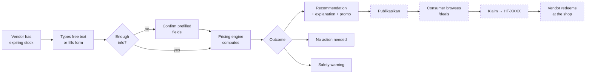
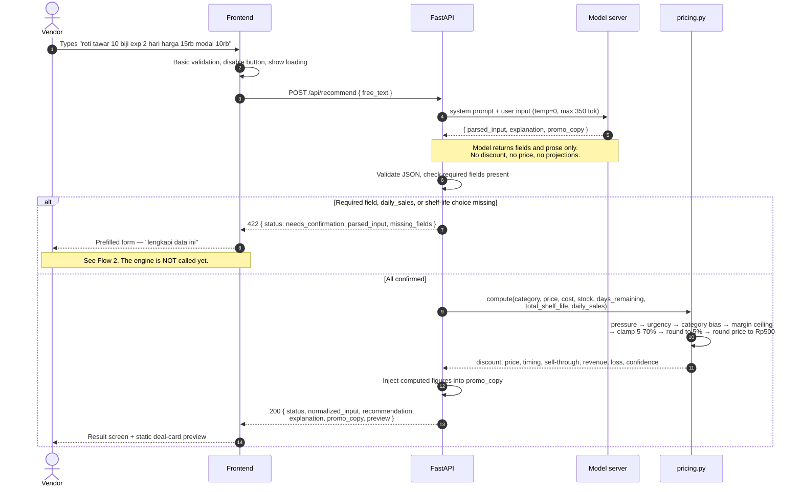
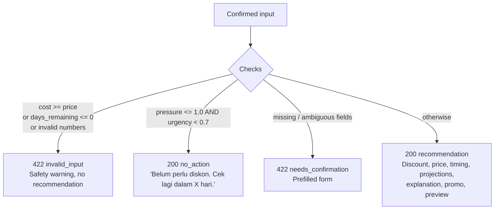
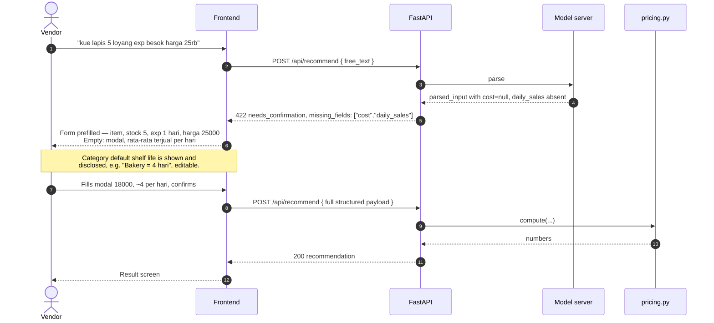
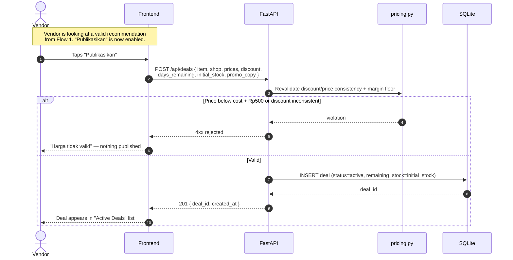
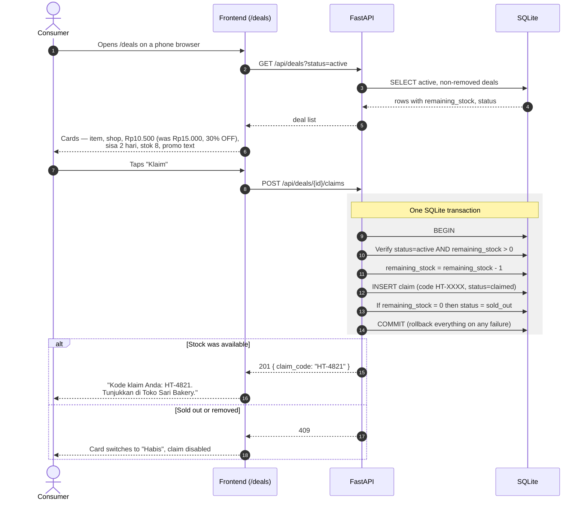
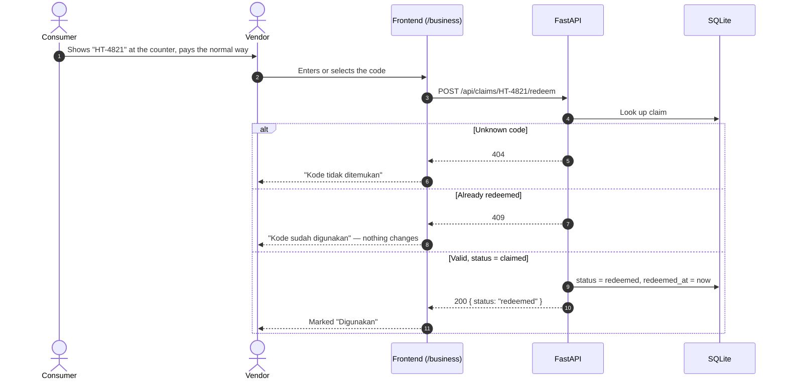
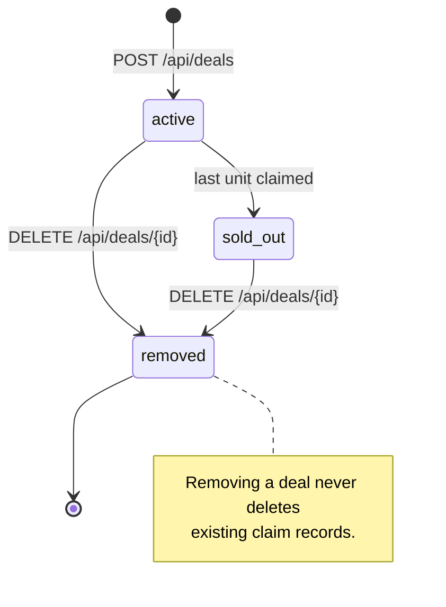

# HargaTurun

**AI-powered surplus-food markdown assistant for Indonesian food UMKM.**
Built for COMPFEST 18 — AI Innovation Challenge (theme: *AI for the Backbone of the Economy* → Smart Commerce).

A warung, bakery, or small café owner has stock that will expire. HargaTurun answers two questions in one interaction:
**should I discount this, and by how much?** — then writes the Indonesian explanation and the promo copy for it.

The system is deliberately **hybrid**:

| Component | Owns |
|---|---|
| Fine-tuned Qwen3.5-4B (local, llama.cpp, `temp=0`) | Parsing colloquial Indonesian input → structured fields; writing the explanation and promo copy |
| `pricing.py` (pure Python oracle) | Every number: discount %, price, timing, projections, bounds, margin floor |

The model never does arithmetic. Python never writes prose.

> **Document status:** This repository currently contains specifications only (`docs/`). The flows below are the
> contract that the implementation must satisfy. Setup/`docker compose` instructions belong in this file once the
> code lands.

---

## Scope: two rounds, two different products

| | Penyisihan (preliminary) | Final (10-hour hackathon) |
|---|---|---|
| Spec | [`docs/HargaTurun_Penyisihan_SRS.md`](docs/HargaTurun_Penyisihan_SRS.md) | [`docs/HargaTurun_Final_SRS.md`](docs/HargaTurun_Final_SRS.md) |
| User flow | Vendor asks → vendor gets a recommendation. **Nothing is published.** | Vendor publishes → consumer browses → consumer claims → vendor redeems |
| Persistence | None | SQLite (`deals`, `claims`) |
| Consumer | Static deal-card **preview** only | Real `/deals` route |

Everything below is marked **[P]** (built in penyisihan) or **[F]** (added in the final round).

---

## Actors

| Actor | Who | Where |
|---|---|---|
| **Vendor** | UMKM food owner/manager — Bu Sari (warung), Mas Dimas (café), Mbak Rina (home-based) | `/business` |
| **Consumer** | Price-sensitive buyer — student, budget household. No account, ever. | `/deals` **[F]** |
| **Frontend** | Browser SPA — validation, confirmation state, result screen | — |
| **API** | FastAPI — orchestration only, never a pricing authority | — |
| **Model server** | Local fine-tuned model, static params, `temperature=0` | — |
| **Pricing engine** | `pricing.py`, pure function, no I/O | — |

---

## The whole journey at a glance



Solid boxes are the preliminary MVP **[P]**. Dashed boxes are the final-round extension **[F]**.

---

## Flow 1 — Vendor gets a recommendation **[P]**

The core interaction. One input, one synchronous response, one screen.



**Target:** under 10 seconds end-to-end on 1× 8 GB VRAM GPU. Same confirmed input → byte-identical numbers.

### The four outcomes

Every call to `POST /api/recommend` ends in exactly one of these:



| Outcome | What the vendor sees |
|---|---|
| **Recommendation** | `Rp10.500 (30% off)` · timing · `8 dari 10 pcs terjual` · revenue vs. loss · 2–4 sentence explanation · promo preview |
| **No action** | *"Belum perlu diskon. Item ini kemungkinan terjual normal sebelum kadaluarsa. Cek lagi dalam X hari."* |
| **Needs confirmation** | Prefilled fields with the gaps highlighted. The system never invents `cost`, `daily_sales`, or shelf life. |
| **Safety warning** | *"Harga modal ≥ harga jual. Mohon cek input Anda."* or *"Item sudah kadaluarsa."* No numbers issued. |

Plus one failure mode: `502 model_unavailable` when the model server is down.

---

## Flow 2 — Free text is incomplete **[P]**

The single most common real-world path, because `daily_sales` and `total_shelf_life` are almost never in a
colloquial one-liner. **The backend must ask, not guess.**



Second call skips the model entirely when the payload is fully structured — the model is only needed for
parsing and prose.

### Category shelf-life defaults

Used when the vendor does not supply `total_shelf_life`; always disclosed in the result.

| Bakery | Prepared Food | Dairy | Beverage | Produce | Snack | Canned | Other |
|---:|---:|---:|---:|---:|---:|---:|---:|
| 4 d | 3 d | 14 d | 5 d | 7 d | 90 d | 365 d | 30 d |

---

## Flow 3 — Vendor publishes a deal **[F]**

Only a successful, validated recommendation can become a deal. The client is never trusted as the pricing
authority — the server revalidates every number.



The vendor may remove a deal at any time (`DELETE /api/deals/{id}` → `204`, status becomes `removed`).
**There is no automatic expiry** — that would require background work, which is out of scope. The UI may display
a time-remaining hint but must not promise an automatic status change.

---

## Flow 4 — Consumer browses and claims **[F]**

No login. No geolocation. No payment. Just today's deals.



**Invariant:** `remaining_stock` can never go negative, and no claim is ever issued after sellout — even under
simultaneous local taps. The conditional check and the decrement live in the same transaction.

---

## Flow 5 — Redemption at the shop **[F]**



**Stock is reserved at claim time, not at redemption.** Redemption confirms collection and must never decrement
stock a second time.

---

## Deal lifecycle **[F]**



Claim: `claimed` → `redeemed`. One-way, once. Claims made before removal stay redeemable until the vendor
manually rejects them.

---

## How the recommendation is actually computed

Full derivation in [`docs/HargaTurun_Project_Spec.md`](docs/HargaTurun_Project_Spec.md) §9.5. The shape of it:

```
1. days_of_supply = stock / daily_sales
   pressure       = days_of_supply / days_remaining      → >1 means surplus exists
2. life_consumed  = 1 - days_remaining / total_shelf_life
   urgency        = life_consumed ^ 1.5                  → non-linear near expiry
3. category bias  Bakery 1.3 … Canned 0.7                → soft elasticity prior
4. raw_discount   = pressure_factor × urgency × bias × 80
5. max_discount   = min(70, margin% - Rp500-per-unit guard)
6. discount       = round_to_5(clamp(raw, 5, max_discount))
7. price          = max(round_to_500(price × (1-d)), cost + 500)
8. projections    expected sell-through, revenue, loss if nothing is done
9. timing         "Belum perlu diskon" | "Bisa tunggu 1 hari" | "Mulai diskon hari ini"
10. confidence    "Cukup yakin" | "Prediksi kurang pasti"
```

**Hard guarantees the vendor can rely on:** discount stays within 5–70%; the recommended price is never below
`cost + Rp500`; prices round to Rp500 and discounts to 5% (Indonesian pricing convention).

Special cases short-circuit the formula: expires today → fire sale at the margin ceiling with *"HARI INI SAJA!"*;
stock ≤ 2 → minimal 5–15% discount, not worth the margin; already expired → discard/donate advice, no deal.

---

## API surface

| Method | Endpoint | Round | Purpose |
|---|---|---|---|
| `POST` | `/api/recommend` | **[P]** | The core interaction. Returns one of four outcomes. |
| `POST` | `/api/deals` | **[F]** | Publish a revalidated recommendation → `201 { deal_id }` |
| `GET` | `/api/deals?status=active` | **[F]** | Consumer feed |
| `DELETE` | `/api/deals/{id}` | **[F]** | Mark `removed` → `204` |
| `POST` | `/api/deals/{id}/claims` | **[F]** | Claim one unit → `201 { claim_code }` / `409` |
| `POST` | `/api/claims/{code}/redeem` | **[F]** | Redeem once → `200` / `404` / `409` |

## Deployment topology

```
Penyisihan [P]                          Final [F] adds SQLite
─────────────────────────               ─────────────────────────
Browser SPA                             Browser SPA
   │ HTTP                                  ├─ /business ──┐
   ▼                                       └─ /deals ─────┤
FastAPI ──HTTP──► local model server                      ▼
   │                                                   FastAPI ──► model server
   └──► pricing.py                                        ├──► pricing.py
                                                          └──► data/hargaturun.db
```

`docker compose up` starts frontend + API + model server (+ a mounted volume for the SQLite file in the final
round). No database *service*, no queue, no worker, no scheduled task — by design and by competition rule.

---

## Smoke tests

**Preliminary [P]**
```
structured input        → complete recommendation
colloquial free text    → parses, then completes after confirmation
missing cost            → needs_confirmation, never a fabricated number
far-expiry low-pressure → no_action
expires today           → bounded fire sale, margin floor still holds
cost >= price           → warning, no recommendation
same input twice        → identical numbers
```

**Final [F]**
```
recommend → publish → browse → claim → redeem → restart API → state persists
stock = 1: first claim 201, second claim 409, remaining_stock = 0
redeem the same code twice: 200 then 409
publish a price below the margin floor: rejected by the server
```

---

## Documents

| File | What it is |
|---|---|
| [`docs/HargaTurun_Project_Spec.md`](docs/HargaTurun_Project_Spec.md) | Problem, personas, the full oracle formula, model choice, business model, risks |
| [`docs/HargaTurun_Penyisihan_SRS.md`](docs/HargaTurun_Penyisihan_SRS.md) | **Authoritative** preliminary scope, API contract, acceptance criteria |
| [`docs/HargaTurun_Final_SRS.md`](docs/HargaTurun_Final_SRS.md) | Final-round marketplace loop, data model, phased cut line |
| [`docs/HargaTurun_FineTuning_Plan.md`](docs/HargaTurun_FineTuning_Plan.md) | QLoRA runbook — data generation, hyperparameters, eval, GGUF export |
| [`docs/AIC_Technical_Guide.md`](docs/AIC_Technical_Guide.md) | Competition rules, technical constraints only |
| [`docs/AI_Innovation_Challenge.md`](docs/AI_Innovation_Challenge.md) | Full rulebook |

Where the Project Spec and the SRS documents disagree on scope, **the SRS wins** — the Project Spec describes the
two-sided vision, the SRSs describe what each round actually ships.

---

*Licensed under the terms in [LICENSE](LICENSE).*
