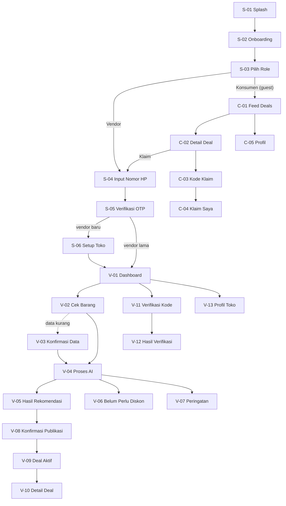

# HargaTurun — Spesifikasi Halaman untuk Handover UI/UX

**Target:** aplikasi mobile (handphone + tablet), satu app untuk dua role.
**Dokumen ini menjawab satu pertanyaan:** *setiap halaman harus berisi apa, dalam kondisi apa saja, dan copy-nya bagaimana.*
Bukan dokumen visual — warna, ilustrasi, dan komponen final adalah pekerjaan UI/UX.

---

## 0. Baca ini dulu — dua perubahan dari spec lama

Dokumen di `docs/` menyatakan hal yang **bertentangan** dengan brief ini. Bukan penghalang, tapi harus disadari sebelum desain jalan:

| Yang ditulis di spec | Yang diminta sekarang | Konsekuensi |
|---|---|---|
| *"Authentication / accounts — OUT OF SCOPE"* (Project Spec §8.2, Penyisihan SRS §1.2, Final SRS §2.2) | Ada login | Aturan AIC penyisihan melarang *"sistem otentikasi yang kompleks"*. **OTP + nomor HP masih aman** — itu auth sederhana, bukan RBAC/SSO. Tapi backend perlu endpoint baru yang belum ada di API contract manapun. |
| *"Mobile native app — OUT OF SCOPE. Web-only, responsive"* (Project Spec §8.2) | Mobile app phone + tablet | Kalau ini dibangun sebagai **PWA / responsive web app** yang dipakai di HP, spec lama tetap terpenuhi dan `docker compose` tetap jalan. Kalau native (Flutter/RN), deliverable AIC (`docker compose up` → panitia buka di browser) jadi bermasalah. **Rekomendasi: PWA mobile-first.** Untuk UI/UX tidak ada bedanya — spesifikasi halaman di bawah identik. |

Selain itu, satu penyesuaian yang aku ambil sendiri: spec bilang konsumen harus bisa **browse tanpa registrasi** (FR-15, C3). Itu prinsip produk yang bagus dan tidak perlu dibuang hanya karena ada login. Jadi:

> **Konsumen bisa lihat feed deals tanpa login. Login baru diminta saat menekan "Klaim".**
> Vendor wajib login sejak awal.

Kalau kamu mau konsumen tetap wajib login dari splash, hapus jalur guest di S-03 dan C-01 — sisanya tidak berubah.

### Keputusan yang sudah terkunci

| Keputusan | Pilihan |
|---|---|
| Struktur app | Satu app, dua role (Vendor / Konsumen), tab bar berbeda per role |
| Autentikasi | Nomor HP + OTP |
| Cakupan | Full produk: AI core + marketplace (publish, klaim, redeem) |

---

## 1. Produk dalam satu paragraf

Pemilik warung/bakery/kafe punya stok yang mau kadaluarsa. Dia buka HargaTurun, ketik *"roti tawar 10 biji exp 2 hari harga 15rb modal 10rb"*, dan dalam ~10 detik dapat: **berapa persen harus diskon**, **harga jualnya berapa**, **kenapa segitu**, dan **teks promo siap pakai**. Satu tap lagi, deal itu tayang di feed konsumen. Konsumen dekat situ lihat, klaim, dapat kode, datang ke toko, bayar seperti biasa.

Angka dihitung Python (deterministik, selalu sama). Bahasa ditulis AI. **Model tidak pernah menghitung, Python tidak pernah menulis kalimat.**

---

## 2. Fondasi desain

### 2.1 Perangkat & breakpoint

| Kelas | Lebar | Target | Layout |
|---|---|---|---|
| **Phone kecil** | 320–359 dp | Android entry-level (masih banyak di UMKM) | 1 kolom, wajib tidak overflow |
| **Phone** | 360–429 dp | **Perangkat utama, desain di sini dulu** | 1 kolom |
| **Phone besar** | 430–599 dp | iPhone Pro Max, Android flagship | 1 kolom, padding lebih lega |
| **Tablet potret** | 600–904 dp | iPad mini, tab Android | 2 kolom untuk list, form max-width 560 dp |
| **Tablet lanskap** | 905 dp ke atas | iPad, tablet kasir | Master–detail (list kiri, detail kanan) |

- **Orientasi:** phone dikunci potret. Tablet wajib mendukung potret
- **Safe area:** hormati notch, status bar, dan gesture bar. Bottom nav minimal 16 dp di atas gesture bar.
- **Skala:** desain di 360 dp, verifikasi tidak pecah di 320 dp dan tidak "melar aneh" di 1024 dp.

### 2.2 Aturan sentuh

- Target sentuh minimal **48 × 48 dp**. Tidak ada pengecualian, termasuk tombol hapus deal.
- Aksi primer harus berada di **thumb zone** (sepertiga bawah layar). Vendor sering pakai satu tangan sambil pegang barang.
- Jarak antar target ≥ 8 dp.
- Aksi destruktif (hapus deal) **tidak boleh** bersebelahan langsung dengan aksi utama.

### 2.3 Tipografi & angka

- Bahasa Indonesia punya kata panjang: *"Rekomendasi"*, *"Publikasikan"*, *"Kadaluarsa"*, *"Berlaku hari ini saja"*. Tombol harus tahan teks 14+ karakter tanpa terpotong.
- **Format Rupiah: `Rp15.000`** — titik sebagai pemisah ribuan, tanpa spasi setelah `Rp`, tanpa desimal. Konsisten di semua layar.
- Harga coret (harga asli) harus terbaca jelas sebagai *bekas harga*, bukan sekadar abu-abu tipis.
- Angka besar (proyeksi pendapatan) perlu ukuran font berbeda dari label — ini yang dilihat vendor pertama kali.
- Dukungan **dynamic type / font scaling** sampai 130%. Banyak pemilik warung usia 40+ menaikkan ukuran font sistem.

### 2.4 Semantik warna — sistem urgensi

Ini bukan dekorasi, ini informasi. Tiga tingkat, dipakai konsisten di badge, chip, dan border kartu:

| Tingkat | Kondisi | Makna untuk user |
|---|---|---|
| **Aman** | `days_remaining` masih jauh, tidak perlu diskon | "Tenang, belum perlu apa-apa" |
| **Perhatian** | Perlu diskon, masih ada waktu | "Mulai pikirkan diskon" |
| **Kritis** | Kadaluarsa hari ini / besok, atau stok mau habis | "Hari ini juga" |

Jangan pakai merah untuk *diskon besar* — merah dipakai untuk *urgensi* dan *error*. Diskon besar itu kabar baik untuk konsumen, kabar netral untuk vendor.

Status chip yang perlu style tersendiri: `Aktif`, `Habis`, `Dihapus`, `Sudah digunakan`, `Belum diambil`.

### 2.5 Aksesibilitas & konteks pakai nyata

- Kontras teks minimal **4.5:1**. App ini dipakai di warung terbuka, siang hari, layar silau, screen protector buram.
- Jangan pernah pakai **warna saja** untuk membedakan status — selalu ada ikon atau teks.
- Semua ikon aksi wajib punya label teks. Target user tidak menebak arti ikon.
- Perangkat low-end: hindari animasi berat, blur, dan shadow bertumpuk.
- Semua copy Bahasa Indonesia sehari-hari. **Dilarang** muncul di UI: *markdown optimization*, *price elasticity*, *sell-through*, *pressure*, *inference*, *confidence score*.

### 2.6 State global yang wajib didesain sekali dan dipakai di mana-mana

| State | Kapan muncul | Catatan |
|---|---|---|
| **Loading (skeleton)** | Feed, daftar deal | Skeleton, bukan spinner penuh layar |
| **Loading (proses AI)** | Hanya di V-04 | Butuh treatment khusus, bisa 10 detik. Lihat V-04. |
| **Kosong** | Belum ada deal, belum ada klaim | Butuh ilustrasi + kalimat + tombol aksi |
| **Error jaringan** | Request gagal | Ada tombol "Coba Lagi", jangan buang input user |
| **Offline** | Tidak ada koneksi | Banner persisten di atas, konten cached tetap terlihat |
| **Server AI mati** | `502 model_unavailable` | Pesan khusus: "Sistem AI sedang tidak tersedia" + saran isi form manual |

---

## 3. Peta navigasi



### Tab bar

**Role Vendor — 4 tab**

| Tab | Label | Layar |
|---|---|---|
| 1 | Beranda | V-01 |
| 2 | Deal Saya | V-09 |
| 3 | Verifikasi | V-11 |
| 4 | Profil | V-13 |

Aksi utama **"Cek Barang" (V-02)** adalah FAB / tombol besar di Beranda — bukan tab. Ini aksi yang paling sering dipakai dan harus terasa seperti aksi, bukan navigasi.

**Role Konsumen — 3 tab**

| Tab | Label | Layar |
|---|---|---|
| 1 | Deals | C-01 |
| 2 | Klaim Saya | C-04 |
| 3 | Profil | C-05 |

Perpindahan role ada di Profil, bukan di tab bar.

---

## 4. Daftar halaman

| ID | Halaman | Role | Prioritas | Catatan |
|---|---|---|---|---|
| S-01 | Splash | Semua | P1 | |
| S-02 | Onboarding | Semua | P2 | Bisa dipotong kalau waktu mepet |
| S-03 | Pilih Role | Semua | P0 | |
| S-04 | Input Nomor HP | Semua | P0 | |
| S-05 | Verifikasi OTP | Semua | P0 | |
| S-06 | Setup Toko | Vendor | P1 | |
| V-01 | Dashboard / Beranda | Vendor | P0 | |
| V-02 | Cek Barang (input) | Vendor | **P0 — inti produk** | |
| V-03 | Konfirmasi Data | Vendor | P0 | Sering muncul, jangan dianggap edge case |
| V-04 | Proses AI | Vendor | P0 | Butuh desain khusus |
| V-05 | Hasil Rekomendasi | Vendor | **P0 — layar paling penting** | |
| V-06 | Belum Perlu Diskon | Vendor | P0 | |
| V-07 | Peringatan Input | Vendor | P0 | |
| V-08 | Konfirmasi Publikasi | Vendor | P1 | |
| V-09 | Deal Aktif | Vendor | P1 | |
| V-10 | Detail Deal | Vendor | P1 | |
| V-11 | Verifikasi Kode | Vendor | P1 | |
| V-12 | Hasil Verifikasi | Vendor | P1 | |
| V-13 | Profil Toko | Vendor | P2 | |
| C-01 | Feed Deals | Konsumen | P1 | |
| C-02 | Detail Deal | Konsumen | P1 | |
| C-03 | Kode Klaim | Konsumen | P1 | |
| C-04 | Klaim Saya | Konsumen | P2 | |
| C-05 | Profil Konsumen | Konsumen | P2 | |

**Garis potong hackathon 10 jam:** P0 dulu sampai tuntas, baru P1, P2 terakhir. Jangan mulai C-01 kalau V-05 belum beres.

---

# 5. Spesifikasi per halaman

---

## S-01 · Splash

**Tujuan** — jembatan sambil cek sesi login.
**Masuk dari** — buka app. **Keluar ke** — V-01 (vendor login), C-01 (konsumen login), S-02 (pertama kali), S-03 (pernah buka, belum login).

**Isi:** logo, nama produk, tagline satu baris (*"Jangan buang, turunkan harganya."*), indikator loading halus.

**Aturan:** maksimal 2 detik. Kalau cek sesi lebih lama, tetap lanjut dan cek di background. Jangan pernah menahan user di splash.

**Tablet:** logo di tengah optik (sedikit di atas titik tengah), bukan tengah matematis.

---

## S-02 · Onboarding

**Tujuan** — jelaskan nilai produk dalam 3 layar sebelum minta apa pun.
**Masuk dari** — S-01 (instalasi baru). **Keluar ke** — S-03.

**Isi — 3 slide, bisa di-skip kapan saja:**

| Slide | Pesan | Nada |
|---|---|---|
| 1 | *"Stok mau kadaluarsa? Jangan dibuang."* | Masalah |
| 2 | *"AI hitung harga diskon yang pas — nggak rugi, nggak kebanyakan."* | Solusi |
| 3 | *"Pembeli sekitar langsung lihat promomu."* | Hasil |

**Komponen:** ilustrasi per slide, judul, 1 kalimat penjelas, page indicator, tombol "Lanjut" / "Mulai", link "Lewati" di kanan atas.

**Aturan:** swipe horizontal wajib jalan. Tombol "Lewati" selalu terlihat. Onboarding hanya muncul sekali seumur instalasi.

**Tablet:** ilustrasi kiri, teks kanan (lanskap). Jangan sekadar melebarkan layout phone.

---

## S-03 · Pilih Role

**Tujuan** — user menyatakan dia penjual atau pembeli. Ini menentukan seluruh isi app setelahnya.
**Masuk dari** — S-02 / S-01. **Keluar ke** — S-04 (vendor) atau C-01 (konsumen, tanpa login).

**Isi:** dua kartu besar sejajar vertikal.

| Kartu | Judul | Penjelas | Aksi |
|---|---|---|---|
| Vendor | *"Saya punya usaha makanan"* | *"Dapat rekomendasi harga diskon dari AI"* | → S-04 |
| Konsumen | *"Saya mau cari makanan murah"* | *"Lihat promo hari ini di sekitarmu"* | → C-01 langsung |

**Aturan & edge case:**
- Kartu konsumen **tidak** menuju login. Langsung ke feed. Ini disengaja.
- Role bisa diganti nanti lewat Profil — sebutkan itu di teks kecil bawah: *"Bisa diubah nanti di Profil."*
- Satu nomor HP boleh punya dua role.

**Tablet:** dua kartu berdampingan, tinggi sama.

---

## S-04 · Input Nomor HP

**Tujuan** — kumpulkan satu data saja: nomor HP.
**Masuk dari** — S-03 (vendor), C-02 (konsumen menekan Klaim). **Keluar ke** — S-05.

**Isi:**
- Judul: *"Masuk atau Daftar"*
- Penjelas: *"Kami kirim kode verifikasi ke WhatsApp/SMS kamu."*
- Prefix `+62` terkunci di kiri field, tidak bisa dihapus user
- Field nomor, **keyboard numerik langsung terbuka**, autofocus
- Tombol primer: *"Kirim Kode"* (disabled sampai nomor valid)
- Teks kecil: persetujuan syarat & privasi

**Validasi:**

| Kondisi | Perilaku |
|---|---|
| User ketik `08...` | Otomatis dinormalisasi jadi `8...` setelah prefix `+62` |
| Panjang < 9 digit | Tombol disabled, belum ada pesan error |
| Karakter non-angka | Tolak input, bukan tampilkan error |
| Format salah setelah blur | *"Nomor HP tidak valid"* di bawah field |

**Edge case:** kalau masuk dari C-02 (mau klaim), tampilkan konteks di atas: *"Masuk dulu untuk klaim deal ini"* — dan setelah OTP sukses, **kembali ke deal yang tadi**, bukan ke feed.

**Tablet:** form max-width 480 dp, rata tengah. Jangan field selebar layar.

---

## S-05 · Verifikasi OTP

**Tujuan** — verifikasi kepemilikan nomor.
**Masuk dari** — S-04. **Keluar ke** — S-06 (vendor baru), V-01 (vendor lama), atau kembali ke konteks asal (konsumen).

**Isi:**
- Judul: *"Masukkan Kode"*
- Penjelas dengan nomor yang dituju + link **"Ubah nomor"** → kembali ke S-04
- Input OTP **6 digit**, kotak terpisah, autofocus di kotak pertama
- Auto-submit begitu digit ke-6 terisi — jangan paksa user tekan tombol
- Timer kirim ulang: *"Kirim ulang kode dalam 00:59"*, jadi tombol aktif setelah habis
- Tautan bantuan: *"Tidak menerima kode?"*

**State:**

| State | Tampilan |
|---|---|
| Idle | Kotak kosong, timer jalan |
| Mengetik | Kotak terisi satu per satu, ada highlight aktif |
| Memverifikasi | Kotak terkunci + loading, jangan ganti layar |
| Salah | Kotak jadi merah, getar halus, kode dikosongkan, fokus balik ke kotak 1 |
| Kadaluarsa | *"Kode sudah kadaluarsa. Minta kode baru."* |
| Terlalu sering | *"Terlalu banyak percobaan. Coba lagi dalam 5 menit."* |

**Aturan:** wajib mendukung **autofill OTP dari SMS**. Ini menghemat frustrasi paling besar di layar ini. Paste 6 digit sekaligus harus mengisi semua kotak.

---

## S-06 · Setup Toko *(vendor baru saja)*

**Tujuan** — ambil nama toko sekali, dipakai selamanya di promo dan kartu deal.
**Masuk dari** — S-05 (vendor pertama kali). **Keluar ke** — V-01.

**Isi:**

| Field | Wajib | Aturan |
|---|---|---|
| Nama toko | Ya | Muncul di kartu deal konsumen. Contoh: *"Toko Sari Bakery"* |
| Jenis usaha | Ya | Pilihan: Warung/Toko, Bakery, Kafe/Kedai, Rumah Makan, Katering, Jualan Online |
| Alamat singkat | Tidak | Teks bebas, untuk konsumen tahu arah. **Bukan** peta/GPS. |

**Aturan:**
- Nama toko wajib — tanpa ini kartu deal terlihat kosong.
- Tampilkan **live preview kartu deal** di bawah form saat mengetik. Ini membuat vendor paham kenapa datanya diminta.
- Bisa diubah nanti di V-13.

**Tablet:** form kiri, preview kartu kanan, keduanya terlihat bersamaan.

---

## V-01 · Dashboard / Beranda Vendor

**Tujuan** — jawab dua hal dalam 3 detik: *apa yang mendesak hari ini* dan *apa aksi berikutnya*.
**Masuk dari** — login, tab 1. **Keluar ke** — V-02 (aksi utama), V-09, V-11.

**Isi, urut dari atas:**

1. **Sapaan + nama toko** — *"Halo, Toko Sari Bakery"*
2. **Aksi utama — tombol besar "Cek Barang"** → V-02. Ini elemen terbesar di layar. Kalau vendor hanya melakukan satu hal, ini yang harus dia temukan.
3. **Ringkasan hari ini** — 3 angka, jangan lebih:

| Angka | Label |
|---|---|
| Deal aktif | *"Deal aktif"* |
| Total stok belum terjual di semua deal | *"Barang menunggu pembeli"* |
| Klaim belum diambil | *"Perlu diverifikasi"* |

4. **Perlu perhatian** — daftar maksimal 3 deal yang stoknya masih banyak dan waktunya tinggal sedikit. Tiap baris → V-10.
5. **Klaim masuk** — kode yang sudah diklaim tapi belum diambil, dengan tombol cepat → V-11.

**State:**

| State | Tampilan |
|---|---|
| Vendor baru, belum pernah cek | Ringkasan disembunyikan. Ganti dengan kartu ajakan: *"Belum ada deal. Coba cek barang yang mau kadaluarsa."* + tombol |
| Ada data | Layout penuh seperti di atas |
| Loading | Skeleton pada 3 angka dan daftar |
| Offline | Banner atas, data terakhir tetap tampil dengan label *"Data terakhir"* |

**Aturan:** angka pendapatan kumulatif, grafik tren, dan riwayat **tidak ada di sini** — itu analytics, di luar scope dan dilarang aturan kompetisi.

**Tablet lanskap:** dua kolom — kiri aksi utama + ringkasan, kanan daftar perhatian + klaim masuk.

---

## V-02 · Cek Barang *(layar inti)*

**Tujuan** — vendor memasukkan satu barang, dengan cara apa pun yang paling nyaman baginya.
**Masuk dari** — V-01. **Keluar ke** — V-04 (proses), atau V-03 (data kurang).

**Dua mode input dalam satu layar, dipilih lewat toggle di atas:**

### Mode A — Ketik Bebas *(default)*

- Field teks besar, multiline, 3–4 baris
- Placeholder berisi contoh nyata: *"roti tawar 10 biji exp 2 hari harga 15rb modal 10rb"*
- Di bawah field: chip contoh yang bisa ditekan untuk mengisi otomatis — bagus untuk demo dan untuk user pertama kali
- Tombol mikrofon **tidak ada** (voice input di luar scope)

### Mode B — Isi Form

Field, urut, dengan label Bahasa Indonesia:

| Field | Label UI | Tipe | Wajib | Aturan |
|---|---|---|---|---|
| `item_name` | Nama barang | Teks | Ya | |
| `category` | Kategori | Pilihan | Ya | 8 opsi tetap: Bakery, Makanan Siap Saji, Susu & Olahan, Minuman, Sayur & Buah, Snack, Kalengan, Lainnya |
| `stock` | Jumlah stok | Angka | Ya | Bilangan bulat, minimal 1 |
| `days_remaining` | Sisa waktu | Angka / date picker | Ya | Terima "hari ini" = 0, "besok" = 1 |
| `original_price` | Harga jual sekarang | Rupiah | Ya | Format otomatis saat mengetik |
| `cost` | Harga modal | Rupiah | Ya | |
| `daily_sales` | Rata-rata terjual per hari | Angka | Ya | **Field paling sering diabaikan — beri penjelas** |
| `total_shelf_life` | Umur simpan total | Angka hari | Tidak | Terisi otomatis dari kategori, bisa diubah |
| `shop_name` | Nama toko | Teks | Tidak | Terisi dari profil |

**Aturan penting per field:**

- **Kategori** langsung mengubah default umur simpan. Saat user pilih "Bakery", field umur simpan terisi `4 hari` dengan catatan: *"Perkiraan umum untuk kategori ini. Ubah kalau berbeda."* Ini transparansi, jangan disembunyikan.
- **Harga modal** butuh tooltip: *"Berapa modal kamu per satu barang ini?"* Sebagian vendor bingung antara modal per batch dan per unit.
- **Rata-rata terjual per hari** butuh penjelas: *"Kira-kira saja, tidak harus tepat."* Tanpa ini vendor berhenti di sini karena merasa tidak punya data.
- **Kafe / makanan olahan:** tambahkan catatan di kategori Minuman & Makanan Siap Saji: *"Hitung dalam porsi jadi, bukan bahan mentah. Contoh: 2 liter susu ≈ 20 gelas latte."*
- Validasi `cost >= original_price` **tidak dilakukan di sini** — biarkan lewat, ditangani sebagai V-07 supaya pesannya jelas dan konsisten.

**Tombol primer:** *"Dapatkan Rekomendasi"* — sticky di bawah, selalu terlihat meski keyboard terbuka.

**State:**

| State | Tampilan |
|---|---|
| Kosong | Tombol disabled |
| Sebagian terisi | Tombol disabled, error belum muncul |
| Valid | Tombol aktif |
| Dikirim | Tombol jadi loading, form terkunci, lanjut ke V-04 |

**Tablet:** form 2 kolom, field pendek (angka) berdampingan. Tombol tetap di bawah, tidak melayang di tengah.

---

## V-03 · Konfirmasi Data

**Tujuan** — AI berhasil membaca sebagian, tapi ada yang kurang. Sistem **bertanya, tidak menebak**.
**Masuk dari** — V-02 mode ketik bebas, saat respons `422 needs_confirmation`. **Keluar ke** — V-04.

**Ini bukan layar error.** Ini kondisi normal dan sering — `daily_sales` dan umur simpan hampir tidak pernah ada di kalimat sehari-hari. Nada copy harus netral, bahkan positif.

**Isi:**
- Judul: *"Lengkapi sedikit lagi"*
- Penjelas: *"Kami sudah baca inputmu. Tinggal beberapa data ini."*
- **Kutipan input asli vendor** ditampilkan di atas (bisa dilipat) — supaya dia ingat konteksnya
- Form sama seperti V-02 Mode B, dengan pembedaan visual tegas:

| Jenis field | Tampilan |
|---|---|
| Sudah terbaca AI | Terisi, latar berbeda, ada ikon centang, tetap bisa diedit |
| Belum terisi | Kosong, ada penanda "perlu diisi", **fokus otomatis ke field pertama yang kosong** |

- Tombol: *"Hitung Sekarang"* (primer) dan *"Ubah Input"* (sekunder → V-02)

**Aturan:**
- Field kosong **tidak boleh** diisi tebakan sistem. Kalau AI tidak yakin, biarkan kosong.
- Kalau AI salah baca (misal harga tertukar dengan modal), vendor harus bisa memperbaikinya tanpa mengulang dari awal.
- Umur simpan default kategori: tampilkan nilainya + label *"otomatis"*, bukan kosong.

---

## V-04 · Proses AI

**Tujuan** — menahan perhatian selama sampai 10 detik tanpa membuat user merasa app-nya hang.
**Masuk dari** — V-02 / V-03. **Keluar ke** — V-05, V-06, atau V-07.

**Kenapa butuh layar sendiri:** model jalan lokal di GPU. Cold start bisa 60 detik, inferensi normal di bawah 10 detik. Spinner biasa akan terasa seperti macet.

**Isi:**
- Animasi ringan (bukan spinner polos)
- **Teks status yang berganti bertahap** — ini kuncinya:

| Detik | Teks |
|---|---|
| 0–3 | *"Membaca data barangmu..."* |
| 3–7 | *"Menghitung harga terbaik..."* |
| 7+ | *"Menyiapkan rekomendasi..."* |
| > 20 dtk | *"Sedikit lebih lama dari biasanya, mohon tunggu..."* |

- Ringkasan barang yang sedang diproses ditampilkan kecil di bawah (nama + stok + sisa hari)

**Aturan:**
- **Tidak ada tombol batal** sebelum detik ke-15. Setelah itu munculkan "Batalkan".
- Kalau gagal (`502`): jangan lempar ke layar error kosong. Tampilkan pesan + tombol *"Coba Lagi"* + *"Isi Form Manual"*, dan **input vendor tidak boleh hilang**.
- Jangan pakai progress bar berpersentase. Durasinya tidak bisa diprediksi, dan bar yang macet di 80% lebih buruk daripada tidak ada bar.

---

## V-05 · Hasil Rekomendasi *(layar paling penting di seluruh app)*

**Tujuan** — vendor paham dalam 5 detik: **berapa harganya**, **kenapa**, dan **apa untungnya**.
**Masuk dari** — V-04. **Keluar ke** — V-08 (publikasikan), V-02 (ubah input), V-01.

**Isi, urut prioritas dari atas:**

### 1. Angka utama
Elemen terbesar di layar:
```
Rp10.500
Diskon 30%   ·  harga asli Rp15.000
```
Harga rekomendasi paling besar. Persentase diskon jadi badge. Harga asli dicoret dan lebih kecil.

### 2. Waktu mulai
Chip dengan warna urgensi: *"Mulai diskon hari ini"* / *"Bisa tunggu 1 hari, cek lagi besok"*.

### 3. Proyeksi — dua kartu berdampingan
| Kartu | Isi | Nada |
|---|---|---|
| Kalau didiskon | *"Perkiraan terjual 8 dari 10 pcs — pemasukan Rp84.000"* | Positif |
| Kalau dibiarkan | *"Perkiraan rugi Rp50.000 karena tidak terjual"* | Peringatan, bukan menakut-nakuti |

Kontras dua kartu ini adalah argumen utama produk. Beri bobot visual yang cukup.

### 4. Penjelasan
2–4 kalimat Bahasa Indonesia dari AI. Beri ikon dan latar berbeda supaya terbaca sebagai "kata sistem", bukan label UI.

> *"Roti tawar punya shelf life pendek dan pembeli sangat sensitif harga. Dengan sisa 2 hari dan stok 10 pcs, diskon dibutuhkan agar tidak terbuang."*

### 5. Tingkat keyakinan
Chip kecil: *"Prediksi cukup yakin"* atau *"Prediksi kurang pasti"*. **Jangan tampilkan angka persentase.**

### 6. Pratinjau kartu deal
Tampilan persis seperti yang akan dilihat konsumen — item, toko, harga coret, badge diskon, sisa waktu, stok, teks promo. Beri label jelas: *"Beginilah tampilannya untuk pembeli"*.

### 7. Aksi
| Tombol | Tipe | Tujuan |
|---|---|---|
| **Publikasikan Deal** | Primer, sticky bawah | V-08 |
| Ubah Input | Sekunder | V-02, data terisi kembali |
| Hitung Lagi | Teks | Ulangi dengan input sama |

**Aturan keras:**
- Vendor **boleh** menaikkan harga dari rekomendasi, **tidak boleh** menurunkan di bawah `modal + Rp500`. Kalau dicoba: tampilkan peringatan dan tolak. Ini janji produk — sistem tidak akan pernah menyuruh vendor rugi.
- Semua angka berasal dari server. UI **tidak menghitung ulang apa pun**, termasuk persentase diskon.
- Teks promo bisa diedit vendor sebelum publish (sesuai Final SRS §4.1: "data tampilan boleh disesuaikan").

**Tablet lanskap:** kiri angka + proyeksi + penjelasan, kanan pratinjau kartu deal sticky. Tombol aksi di bawah kolom kiri.

---

## V-06 · Belum Perlu Diskon

**Tujuan** — memberi tahu bahwa tidak melakukan apa-apa adalah jawaban yang benar.
**Masuk dari** — V-04 saat `status: no_action`. **Keluar ke** — V-01, V-02.

**Isi:**
- Ikon/ilustrasi bernada **tenang, bukan error**
- Judul: *"Belum perlu diskon"*
- Penjelas: *"Barang ini kemungkinan terjual normal sebelum kadaluarsa."*
- Kartu pengingat: *"Cek lagi dalam 5 hari"* — angkanya dari `reassess_in_days` server
- Ringkasan barang yang dicek
- Tombol: *"Cek Barang Lain"* (primer), *"Kembali ke Beranda"* (sekunder)

**Aturan:**
- **Tidak ada tombol publikasikan.** Tidak ada deal yang dibuat.
- Jangan pakai warna/ikon error. Ini kabar baik — vendor menghemat margin.
- Jangan tawarkan "diskon saja walaupun belum perlu". Itu merusak kepercayaan pada rekomendasi.

---

## V-07 · Peringatan Input

**Tujuan** — hentikan proses dengan penjelasan yang bisa ditindaklanjuti.
**Masuk dari** — V-04 saat `status: invalid_input`. **Keluar ke** — V-02 (input terisi kembali).

**Tiga varian, satu layout:**

| Kondisi | Judul | Penjelas | Aksi |
|---|---|---|---|
| `cost >= original_price` | *"Cek harga modalmu"* | *"Harga modal (Rp15.000) sama atau lebih besar dari harga jual (Rp12.000). Diskon akan membuatmu rugi."* | "Perbaiki Input" |
| Sudah kadaluarsa | *"Barang sudah kadaluarsa"* | *"Sebaiknya tidak dijual. Pertimbangkan untuk dibuang atau didonasikan."* | "Cek Barang Lain" |
| Angka tidak masuk akal | *"Ada data yang aneh"* | Sebutkan field spesifik yang bermasalah | "Perbaiki Input" |

**Aturan:**
- Selalu **tunjukkan angka yang bermasalah** di dalam pesan. "Input tidak valid" tanpa konteks tidak berguna.
- Data vendor tidak boleh hilang saat kembali ke V-02.
- Tidak ada rekomendasi, tidak ada angka diskon yang ditampilkan sama sekali.

---

## V-08 · Konfirmasi Publikasi

**Tujuan** — satu langkah sadar sebelum deal terlihat publik.
**Masuk dari** — V-05. **Keluar ke** — V-09.

**Bentuk:** bottom sheet, bukan halaman penuh. Konteks V-05 harus tetap terlihat di belakang.

**Isi:**
- Judul: *"Publikasikan deal ini?"*
- Ringkasan: nama barang, harga deal, jumlah stok yang ditawarkan
- **Field jumlah stok yang dipublikasikan** — default = seluruh stok, bisa dikurangi. Vendor mungkin hanya mau melepas sebagian.
- Catatan: *"Deal langsung terlihat pembeli. Bisa kamu hapus kapan saja."*
- Tombol: *"Ya, Publikasikan"* / *"Batal"*

**State setelah sukses:** toast konfirmasi + pindah ke V-09 dengan deal baru ter-highlight sesaat.

**Edge case — ditolak server:** kalau server menolak karena harga melanggar margin floor, tampilkan pesan di sheet itu juga, jangan tutup sheet dan jangan buang datanya.

---

## V-09 · Deal Aktif

**Tujuan** — vendor melihat semua yang sedang tayang dan mengelolanya.
**Masuk dari** — tab 2, V-08. **Keluar ke** — V-10.

**Isi:** daftar kartu deal, urut paling mendesak di atas.

**Tiap kartu:**
- Nama barang + kategori
- Harga deal + badge diskon
- **Sisa stok: `8 dari 10`** — ini angka yang paling sering dicek vendor
- Chip status: `Aktif` / `Habis`
- Sisa waktu
- Jumlah klaim yang belum diambil, kalau ada

**Filter/segmen di atas:** `Aktif` · `Habis` · `Dihapus`

**State:**

| State | Tampilan |
|---|---|
| Kosong | Ilustrasi + *"Belum ada deal aktif."* + tombol "Cek Barang" |
| Berisi | Daftar kartu |
| Loading | Skeleton 3 kartu |
| Semua habis | Tetap tampilkan, dengan chip `Habis` dan visual redup |

**Aturan:**
- Deal **tidak hilang otomatis** saat lewat tanggal — tidak ada background job. Vendor yang menghapus manual. UI boleh menampilkan petunjuk *"Sudah lewat perkiraan waktu"*, tapi **jangan janjikan penghapusan otomatis**.
- Hapus deal butuh konfirmasi. Sebutkan konsekuensinya: *"Pembeli tidak bisa lihat lagi. Kode yang sudah diklaim tetap berlaku."*

**Tablet lanskap:** master–detail. Daftar kiri, V-10 langsung tampil di kanan.

---

## V-10 · Detail Deal

**Tujuan** — satu deal, semua informasinya, semua aksinya.
**Masuk dari** — V-09, V-01. **Keluar ke** — V-11, V-09.

**Isi:**
1. Kartu deal seperti yang dilihat konsumen
2. **Progres stok** — visual: `8 dari 10 tersisa`, `2 diklaim`, `1 sudah diambil`
3. **Daftar kode klaim** — tiap baris: kode `HT-4821`, waktu klaim, status (`Belum diambil` / `Sudah diambil`), tombol cepat *"Verifikasi"*
4. Data awal: harga asli, modal, diskon, waktu publish
5. Aksi: *"Hapus Deal"* (destruktif, di bawah, terpisah)

**Aturan:**
- Menghapus deal **tidak menghapus** kode klaim yang sudah terbit. Kode lama tetap bisa diverifikasi. Jelaskan ini di dialog konfirmasi.
- Harga deal tidak bisa diedit setelah publish. Kalau mau ubah harga: hapus, lalu hitung ulang. Sebutkan ini eksplisit supaya vendor tidak mencari tombol edit.

---

## V-11 · Verifikasi Kode

**Tujuan** — pembeli berdiri di depan vendor sambil menunjukkan kode. Layar ini harus cepat.
**Masuk dari** — tab 3, V-01, V-10. **Keluar ke** — V-12.

**Isi:**
- Field kode besar, format `HT-____`, prefix `HT-` sudah tercetak
- **Keyboard alfanumerik terbuka otomatis**
- Tombol: *"Verifikasi"*
- Di bawah: daftar klaim yang belum diambil, bisa ditekan langsung tanpa mengetik — ini jalur tercepat dan akan lebih sering dipakai daripada mengetik

**Aturan:**
- Input **case-insensitive**. `ht-4821` harus diterima.
- Tanda hubung otomatis, user tidak perlu mengetiknya.
- QR scan **tidak ada di MVP** (spec: teks cukup, QR opsional). Kalau UI/UX mau menyiapkan slot ikon scan untuk masa depan, boleh, tapi jangan didesain fungsional.
- Layar ini dipakai sambil melayani pembeli — **satu tangan, tanpa scroll**.

---

## V-12 · Hasil Verifikasi

**Tujuan** — jawaban tegas dalam sekali lihat.
**Masuk dari** — V-11. **Keluar ke** — V-11 (verifikasi lagi), V-01.

**Empat hasil, masing-masing harus terlihat berbeda dari jarak satu meter:**

| Hasil | Tampilan | Copy |
|---|---|---|
| **Berhasil** | Hijau, ikon centang besar | *"Kode valid. Serahkan Roti Tawar — Rp10.500."* Sebut nama barang dan harganya. |
| **Sudah dipakai** | Oranye, ikon peringatan | *"Kode ini sudah digunakan pada 14:32 hari ini."* |
| **Tidak ditemukan** | Merah, ikon silang | *"Kode tidak ditemukan. Cek lagi hurufnya."* |
| **Deal sudah dihapus** | Netral, ikon info | *"Deal ini sudah dihapus. Kamu boleh tetap melayani atau menolak."* |

**Aturan:**
- Kasus berhasil **wajib menyebut nama barang dan harga yang harus ditagih**. Vendor mungkin punya beberapa deal jalan bersamaan.
- Verifikasi ganda tidak mengurangi stok lagi — stok sudah berkurang saat klaim, bukan saat verifikasi.
- Tombol utama setelah selesai: *"Verifikasi Kode Lain"* — vendor biasanya melayani beberapa orang berturut-turut.

---

## V-13 · Profil Toko

**Tujuan** — pengaturan minimal.
**Masuk dari** — tab 4.

**Isi:**
- Nama toko, jenis usaha, alamat singkat — bisa diedit (sama seperti S-06)
- Nomor HP terdaftar (hanya tampil, tidak bisa diubah di MVP)
- **Ganti ke tampilan Pembeli** → pindah role ke C-01
- Bantuan / Cara pakai
- Tentang aplikasi + versi
- Keluar (logout) — dengan konfirmasi

**Yang tidak ada:** notifikasi, bahasa (Bahasa Indonesia saja), tema, metode pembayaran, riwayat transaksi.

---

## C-01 · Feed Deals *(konsumen)*

**Tujuan** — konsumen langsung melihat makanan murah hari ini. Tanpa login, tanpa halangan.
**Masuk dari** — S-03, tab 1. **Keluar ke** — C-02.

**Isi:**
- Header: *"Deals Hari Ini"*
- Daftar kartu deal, satu kolom di phone

**Tiap kartu — semua ini wajib ada:**

| Elemen | Contoh | Kenapa wajib |
|---|---|---|
| Emoji/ikon kategori | 🍞 | Pemindaian cepat |
| Nama barang | Roti Tawar | |
| Nama toko | Toko Sari Bakery | Konsumen memilih berdasarkan kedekatan/kenal |
| Harga deal | **Rp10.500** | Elemen terbesar di kartu |
| Harga asli dicoret | ~~Rp15.000~~ | Bukti hemat |
| Badge diskon | 30% OFF | |
| Sisa waktu | Sisa 2 hari / Hari ini saja | **Membangun kepercayaan soal kesegaran** |
| Sisa stok | Stok 8 | Mendorong tindakan jujur, bukan urgensi palsu |
| Teks promo | 1–2 kalimat dari AI | |
| Tombol Klaim | | Nonaktif kalau habis |

**State:**

| State | Tampilan |
|---|---|
| Kosong | *"Belum ada deal hari ini. Cek lagi nanti ya."* + ilustrasi |
| Loading | Skeleton kartu |
| Habis | Kartu redup, badge `Habis`, tombol nonaktif, **diletakkan di bawah** deal aktif |
| Offline | Banner + daftar terakhir yang tersimpan |

**Aturan:**
- **Tanpa login, tanpa lokasi, tanpa filter rumit.** Spec eksplisit: no geolocation, no "near me".
- Pull-to-refresh wajib.
- **Dilarang dark pattern:** tidak ada hitung mundur palsu, tidak ada "3 orang sedang melihat", tidak ada harga asli yang digelembungkan. Semua angka nyata dari vendor.
- Alasan diskon harus terbaca jelas (mendekati kadaluarsa) — ini membangun kepercayaan, bukan mengurangi minat.

**Tablet:** 2 kolom (potret), 3 kolom (lanskap). Tinggi kartu seragam.

---

## C-02 · Detail Deal *(konsumen)*

**Tujuan** — informasi cukup untuk memutuskan berangkat ke toko.
**Masuk dari** — C-01. **Keluar ke** — C-03, atau S-04 kalau belum login.

**Isi:**
- Kartu deal versi besar
- Nama toko + alamat singkat kalau vendor mengisinya
- Sisa waktu, ditulis manusiawi: *"Berlaku sampai besok"*
- Sisa stok
- Teks promo lengkap
- **Cara pakai — 3 langkah bernomor:**
  1. Klaim untuk dapat kode
  2. Datang ke toko, tunjukkan kode
  3. Bayar di tempat seperti biasa
- Catatan jujur: *"Barang mendekati tanggal kadaluarsa, tetap layak konsumsi."*
- Tombol sticky bawah: *"Klaim Sekarang"*

**Aturan:**
- **Tidak ada pembayaran.** Jangan ada UI yang menyiratkan bayar di app.
- Kalau belum login → S-04 dengan konteks, lalu **kembali ke halaman ini**, bukan ke feed.
- Kalau stok habis saat halaman terbuka (`409`): ubah tombol jadi nonaktif dan tampilkan pesan di tempat, jangan lempar user keluar.

---

## C-03 · Kode Klaim

**Tujuan** — tampilkan kode dengan jelas. Layar ini akan di-screenshot dan ditunjukkan di toko.
**Masuk dari** — C-02. **Keluar ke** — C-04, C-01.

**Isi:**
- Konfirmasi sukses
- **Kode `HT-4821` — elemen terbesar di layar**, font monospace/tebal, mudah dibaca dari jarak satu lengan
- Nama barang + toko + harga yang harus dibayar
- Instruksi: *"Tunjukkan kode ini ke penjual."*
- Masa berlaku: *"Berlaku hari ini."*
- Tombol: *"Lihat Klaim Saya"*, *"Cari Deal Lain"*

**Aturan:**
- Harus tetap terbaca saat **kecerahan layar rendah** (di dalam warung) — kontras tinggi, bukan teks tipis abu-abu.
- Kode harus bisa disalin dengan tap-tahan.
- Screenshot harus menghasilkan gambar yang berguna — jangan taruh info penting di elemen yang menghilang.
- **Tidak ada timer hitung mundur.** Klaim tidak kadaluarsa otomatis di MVP.

---

## C-04 · Klaim Saya

**Tujuan** — konsumen menemukan kembali kodenya.
**Masuk dari** — tab 2, C-03.

**Isi:** daftar klaim, terbaru di atas. Tiap baris: kode, nama barang, toko, harga, status chip (`Belum diambil` / `Sudah diambil`), waktu klaim. Tap → tampilan kode besar seperti C-03.

**State kosong:** *"Belum ada klaim. Yuk lihat deals hari ini."* + tombol ke C-01.

**Aturan:** status berubah jadi `Sudah diambil` setelah vendor memverifikasi. Konsumen tidak bisa mengubahnya sendiri.

---

## C-05 · Profil Konsumen

**Isi:** nomor HP terdaftar, **ganti ke tampilan Penjual** (→ V-01 / S-06 kalau belum punya toko), bantuan, tentang, keluar.

Sengaja kosong. Tidak ada preferensi, tidak ada toko favorit, tidak ada notifikasi — semuanya di luar scope.

---

# 6. Komponen yang perlu dibuat

Komponen ini muncul di banyak halaman. Desain sekali, konsisten di mana-mana.

| Komponen | Dipakai di | Varian yang dibutuhkan |
|---|---|---|
| **Kartu Deal** | V-05, V-08, V-09, V-10, C-01, C-02 | Vendor / Konsumen · Aktif / Habis / Dihapus · ringkas / lengkap |
| **Blok Harga** | Semua kartu deal | Harga deal + harga coret + badge diskon |
| **Chip Urgensi** | Kartu, hasil | Aman / Perhatian / Kritis |
| **Chip Status** | V-09, V-10, C-04 | Aktif / Habis / Dihapus / Belum diambil / Sudah diambil |
| **Kartu Statistik** | V-01, V-05 | Angka besar + label + ikon opsional |
| **Field Rupiah** | V-02, V-03 | Format ribuan otomatis saat mengetik |
| **Input OTP** | S-05 | 6 kotak, isi / kosong / error / terkunci |
| **Bottom Sheet** | V-08, konfirmasi hapus | Dengan handle, bisa ditutup dengan swipe |
| **Tombol Sticky Bawah** | V-02, V-05, C-02 | Harus tetap di atas keyboard |
| **State Kosong** | V-09, C-01, C-04 | Ilustrasi + judul + penjelas + tombol aksi |
| **Banner Offline** | Global | Persisten, tidak menutupi konten |
| **Kartu Penjelasan AI** | V-05 | Menandakan teks ini dihasilkan sistem |

---

# 7. Matriks state per halaman

Setiap sel yang bertanda ✓ **wajib ada desainnya** sebelum handover dianggap lengkap.

| Halaman | Loading | Kosong | Error | Offline | Sukses |
|---|:---:|:---:|:---:|:---:|:---:|
| V-01 Dashboard | ✓ | ✓ | ✓ | ✓ | — |
| V-02 Cek Barang | ✓ | — | ✓ | ✓ | — |
| V-03 Konfirmasi | — | — | ✓ | — | — |
| V-04 Proses AI | ✓ | — | ✓ | ✓ | — |
| V-05 Hasil | — | — | — | — | ✓ |
| V-09 Deal Aktif | ✓ | ✓ | ✓ | ✓ | — |
| V-11 Verifikasi | — | ✓ | ✓ | ✓ | ✓ |
| C-01 Feed | ✓ | ✓ | ✓ | ✓ | — |
| C-02 Detail | ✓ | — | ✓ | ✓ | — |
| C-03 Kode Klaim | — | — | — | ✓ | ✓ |
| C-04 Klaim Saya | ✓ | ✓ | ✓ | ✓ | — |

---

# 8. Aturan adaptasi tablet

Tablet **bukan** phone yang dilebarkan. Tiga aturan:

1. **Jangan lebarkan teks tanpa batas.** Paragraf maksimal 65 karakter per baris. Form maksimal 560 dp.
2. **Manfaatkan lebar untuk konteks, bukan untuk jarak.**
   - V-05: hasil di kiri, pratinjau kartu di kanan — vendor lihat keduanya bersamaan
   - V-09 → V-10: master–detail
   - C-01: grid 2–3 kolom
3. **Aksi tetap terjangkau.** Di tablet lanskap, tombol utama jangan di tengah bawah layar 1024 dp — letakkan di kolom yang relevan.

**Wajib diuji:** rotasi di V-05 dan C-01 tidak boleh kehilangan state atau posisi scroll.

---

# 9. Copy deck — kalimat kunci

Bahasa Indonesia sehari-hari. Bukan formal, bukan gaul berlebihan.

| Konteks | Copy |
|---|---|
| Aksi utama vendor | *Cek Barang* |
| Tombol rekomendasi | *Dapatkan Rekomendasi* |
| Publish | *Publikasikan Deal* |
| Tidak perlu diskon | *Belum perlu diskon. Barang ini kemungkinan terjual normal sebelum kadaluarsa.* |
| Cek ulang | *Cek lagi dalam {X} hari* |
| Mendesak | *Mulai diskon hari ini* |
| Tidak mendesak | *Bisa tunggu 1 hari, cek lagi besok* |
| Kadaluarsa hari ini | *HARI INI SAJA!* |
| Modal ≥ jual | *Harga modal sama atau lebih besar dari harga jual. Coba cek lagi.* |
| Sudah kadaluarsa | *Barang sudah kadaluarsa. Sebaiknya dibuang atau didonasikan.* |
| Stok habis | *Habis* |
| Klaim berhasil | *Kode klaim kamu: {kode}. Tunjukkan di {toko}.* |
| Kode sudah dipakai | *Kode ini sudah digunakan.* |
| Kode salah | *Kode tidak ditemukan. Cek lagi hurufnya.* |
| AI mati | *Sistem AI sedang tidak tersedia. Coba lagi sebentar.* |
| Offline | *Tidak ada koneksi. Menampilkan data terakhir.* |
| Keyakinan tinggi | *Prediksi cukup yakin* |
| Keyakinan rendah | *Prediksi kurang pasti* |

**Prinsip nada:** jujur, tidak mendesak-desak, tidak menggurui. Vendor yang memutuskan, AI yang menyarankan.

---

# 10. Checklist handover

Desain dianggap siap diserahkan ke developer kalau:

- [ ] Semua halaman P0 selesai di **360 dp** dan **1024 dp**
- [ ] Semua sel ✓ di matriks state (§7) punya desain
- [ ] Komponen di §6 ada di library, bukan digambar ulang per halaman
- [ ] Semua copy final Bahasa Indonesia, tidak ada *lorem ipsum*, tidak ada istilah teknis
- [ ] Format Rupiah konsisten `Rp15.000` di semua layar
- [ ] Semua target sentuh ≥ 48 dp — dicek, bukan diasumsikan
- [ ] Kontras teks ≥ 4.5:1
- [ ] V-05 diuji dengan angka ekstrem: `Rp2.000` dan `Rp150.000`, stok `1` dan `100`, diskon `5%` dan `70%`
- [ ] Nama barang panjang tidak merusak kartu (uji: *"Kue Lapis Legit Spesial Pandan"*)
- [ ] Nama toko panjang tidak merusak kartu deal
- [ ] Rotasi tablet diuji di V-05 dan C-01
- [ ] Prototype interaktif untuk alur inti: **V-02 → V-04 → V-05 → V-08 → C-01 → C-02 → C-03 → V-11 → V-12**

---

# 11. Yang sengaja TIDAK ada

Jangan desain ini. Semuanya di luar scope, sebagian dilarang aturan kompetisi:

Peta / lokasi terdekat · pembayaran dalam app · notifikasi push · chat vendor–pembeli · rating & ulasan · dashboard analitik / grafik tren · riwayat penjualan · multi-barang sekaligus · scan foto label (OCR) · input suara · multi-bahasa · mode gelap *(P3, kalau sempat)* · toko favorit · pengiriman · kadaluarsa otomatis deal.

---

## Rujukan

| Dokumen | Isi |
|---|---|
| [`README.md`](README.md) | Alur end-to-end + sequence diagram |
| [`docs/HargaTurun_Penyisihan_SRS.md`](docs/HargaTurun_Penyisihan_SRS.md) | Kontrak API `POST /api/recommend`, 4 jenis respons |
| [`docs/HargaTurun_Final_SRS.md`](docs/HargaTurun_Final_SRS.md) | Publish, klaim, redeem, model data |
| [`docs/HargaTurun_Project_Spec.md`](docs/HargaTurun_Project_Spec.md) | Persona, formula pricing (§9.5), prinsip interaksi (§11.3) |

**Kontradiksi antar dokumen:** SRS menang atas Project Spec. Untuk hal yang menyangkut halaman dan state, dokumen ini yang menang.
